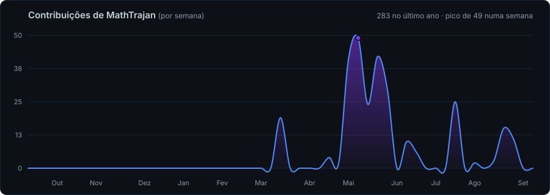

<div align="center">

  <h2>Hey, I'm Matheus Trajano 👋</h2>

  [](https://git.io/typing-svg)

  [](https://linkedin.com/in/matheus-trajano-5179a7378)
  [](https://matheus-dev-beryl.vercel.app/)
  [](mailto:matheustrajano.dev@gmail.com)

</div>

---

### 🧍 About Me

- 🎓 Studying **Análise e Desenvolvimento de Sistemas** at UNIGOIÁS (2024–2027)
- 💼 Currently **Technical Support Analyst** at **A²O Sistemas Gerenciais**: diagnosis, troubleshooting and root-cause analysis of management systems
- 🏗️ Author of a **construction management platform running in production** for a real client: works, budgets, orders, payroll, tax and accounting modules
- ⚖️ Building **Norma**, a multi-tenant SaaS Legal Management System with **11 modules** (Next.js 16 + Prisma/Neon + DataJud API)
- 💬 Building an **embeddable customer-support chat**: widget for the client, panel for the agent, multi-tenant by API key, single runtime dependency
- 💰 Author of **Capital**, a personal finance app with recurring rules, installment plans and goals (NestJS + Angular 17 + PostgreSQL)
- 🤖 Author of **Jarvis**, a **fully offline** LLM chat: local llama.cpp only, no database, no data leaving the machine
- 🗂️ Previously **B2B Analyst** at Probel Mercosul Espumas Industriais (2024–2026): **8+ automations in production · 40% rework reduction · ~15h/week saved**
- 📊 Daily user of **Power BI**, **Power Query (M)** and **SQL Server** against TOTVS Protheus ERP
- 📫 Reach me at **matheustrajano.dev@gmail.com**

---

### 🛠️ Technologies & Tools

#### Languages & Frameworks


#### Data & Databases


-F2C811?style=for-the-badge&logo=microsoft-power-bi&logoColor=black)


#### DevOps & Tools


---

### 💼 Experience

| Role | Company | Period | Highlights |
|------|---------|--------|------------|
| **Technical Support Analyst** | A²O Sistemas Gerenciais | Jun 2026 — Present | Ticket handling, troubleshooting & root-cause analysis of management systems · solution documentation |
| **B2B Analyst** | Probel Mercosul Espumas Industriais | Jul 2024 — Jun 2026 | 8+ production automation routines (PowerShell + Excel COM + Google Drive API) · 40% less rework · TOTVS Protheus ERP via SQL Server · Power BI dashboards |
| **Administrative Assistant** | Drogashop | Dec 2020 — Jun 2024 | Excel automations · 95% post-sales satisfaction |
| **Telemarketing Operator** | Brasil Telecom / OI | Sep 2019 — Sep 2020 | Started as a young apprentice |

---

### 🚀 Featured Projects

<table>
  <tr>
    <td width="50%">
      <h3>⚖️ Norma — SaaS Jurídico</h3>
      <p>
        Sistema de Gestão Jurídica multi-tenant com integração à API do DataJud (CNJ).
        Módulos de processos, clientes, prazos, financeiro, Kanban e dashboard analítico
        com glassmorphism dark theme e animações Framer Motion.
      </p>
      <p>
        
        
        
        
        
      </p>
    </td>
    <td width="50%">
      <h3>🏗️ Gestão de Obras <sub><em>(em produção)</em></sub></h3>
      <p>
        Plataforma de gestão para construtora, <strong>em produção com cliente real
        e contrato assinado</strong>: obras, orçamentos, pedidos, tarefas, clientes,
        financeiro, fiscal, RH/folha e contabilidade. API em Node sobre PostgreSQL
        com migrations versionadas, frontend TypeScript + Vite. Repositório privado.
      </p>
      <p>
        
        
        
        
        
      </p>
    </td>
  </tr>
  <tr>
    <td width="50%">
      <h3>💬 Chat de Atendimento Embutível</h3>
      <p>
        Produto próprio: widget de chat que o cliente embute no site com uma linha
        de script, mais painel de atendimento em tempo real. Multi-tenant por
        <code>apiKey</code>, notificações, transferência e histórico. Backend Node com
        <strong>uma única dependência</strong> (<code>pg</code>), que nem é carregada no modo
        arquivo. Suíte E2E própria em CDP puro, incluindo testes de contraste e de
        segurança. Repositório privado.
      </p>
      <p>
        
        
        
        
        
      </p>
    </td>
    <td width="50%">
      <h3>💰 Capital <sub><em>(gestão financeira)</em></sub></h3>
      <p>
        App de finanças pessoais com recorrências, parcelamentos, metas, categorias
        e dashboard mensal. Agregação mensal concentrada numa <strong>fonte única</strong>
        para KPIs, categorias e evolução, cache stale-while-revalidate no front e
        pré-carga de 13 meses numa request.
      </p>
      <p>
        
        
        
        
        
      </p>
    </td>
  </tr>
  <tr>
    <td width="50%">
      <h3>🤖 Jarvis <sub><em>(LLM 100% offline)</em></sub></h3>
      <p>
        Chat com LLM que roda inteiramente na máquina do usuário: backend Express
        enxuto, SPA sem framework e sem build, modelo local via llama.cpp. Sem banco,
        sem cadastro, sem provedor de nuvem. Nenhum dado sai da máquina, e sem o
        modelo de pé o chat responde 503 de propósito: não existe fallback que vaze
        conversa. Inclui sandbox de arquivos com 47 casos de teste de escape de caminho.
      </p>
      <p>
        
        
        
        
      </p>
    </td>
    <td width="50%">
      <h3>📊 Dashboard Estratégico Power BI</h3>
      <p>
        Dashboard executivo conectado ao SQL Server (TOTVS Protheus) com KPIs de
        margem bruta, crescimento trimestral e mapa de distribuição. Pipeline ETL
        cruzando ERP + VTRINA API + Intelipost via Power Query.
      </p>
      <p>
        
        
        
        
      </p>
    </td>
  </tr>
  <tr>
    <td width="50%">
      <h3>⚙️ Automação ETL — Probel Mercosul B2B</h3>
      <p>
        Infraestrutura de automação PowerShell com Excel COM Interop, fila via
        Mutex global, upload via Google Drive API (OAuth + PATCH) e wrappers VBS
        para execução silenciosa. Monitorado pelo Jarvis em tempo real.
      </p>
      <p>
        
        
        
        
      </p>
    </td>
    <td width="50%">
      <h3>📚 Análise Top 100 Amazon Books</h3>
      <p>
        Pipeline de análise de dados com data lake engine, distribuição de gêneros,
        performance por preço, dashboards e funil de arquitetura de dados.
        Visualizações de performance por gênero e faixa de preço.
      </p>
      <p>
        
        
        
      </p>
    </td>
  </tr>
  <tr>
    <td width="50%">
      <h3>🛏️ E-commerce Pró Colchões</h3>
      <p>
        Landing page e vitrine institucional para a Pró Colchões, com layout responsivo,
        animações suaves e foco em conversão. Integrado com pipeline de dados B2B.
      </p>
      <p>
        
        
        
      </p>
    </td>
    <td width="50%">
      <h3>🧩 Syntra — CRM de Leads</h3>
      <p>
        CRM completo com ciclo de vida de leads, ingestão via webhook (Divia),
        audit trail, Kanban, dashboard de métricas e RBAC. Backend robusto com
        Spring Boot 3 + Flyway + PostgreSQL e frontend Thymeleaf com AJAX.
      </p>
      <p>
        
        
        
        
      </p>
    </td>
  </tr>
  <tr>
    <td width="50%">
      <h3>☕ Fundamentos de Backend em Java</h3>
      <p>
        Estudo dirigido da graduação (ADS/UNIGOIÁS) cobrindo POO, coleções,
        tratamento de exceções e fundamentos de APIs REST. Base para o stack
        Spring Boot usado em Syntra.
      </p>
      <p>
        
        
        
      </p>
    </td>
    <td width="50%">
      <h3>🌐 Portfolio Website</h3>
      <p>
        Portfólio pessoal single-file (HTML5/CSS3/JS puro, ~3k linhas) com
        dark theme, glassmorphism, animações via IntersectionObserver,
        SEO completo (Open Graph + Schema.org) e Vercel Analytics.
      </p>
      <p>
        
        
        
        
      </p>
      <a href="https://matheus-dev-beryl.vercel.app/">Live Demo →</a>
    </td>
  </tr>
</table>

---

### 🔗 Explore os Repositórios

<div align="center">

[](https://github.com/MathTrajan/Sistema-Gestao-Juridica)
[](https://github.com/MathTrajan/Sistema-Financeiro-Pessoal)
[](https://github.com/MathTrajan/Jarvis-Chat-Assistente-Virtual-Inteligente)
[](https://github.com/MathTrajan/CRM-Syntra)
[](https://github.com/MathTrajan/Portfolio-Profissional-Matheus-Trajano)

**🌐 Demo ao vivo:** [Portfólio](https://matheus-dev-beryl.vercel.app/)

</div>

---

### 📈 GitHub Stats

<div align="center">
  <picture>
    <source media="(prefers-color-scheme: dark)" srcset="https://streak-stats.demolab.com/?user=MathTrajan&theme=tokyonight&hide_border=true" />
    <source media="(prefers-color-scheme: light)" srcset="https://streak-stats.demolab.com/?user=MathTrajan&theme=highcontrast&hide_border=true" />
    
  </picture>
</div>

---

### 🎯 Current Focus

```text
🏗️ Gestão de Obras    ███████████████  Em produção · Node · PostgreSQL · Migrations · Fly.io
💬 Chat Embutível     ██████████████░  Widget + painel · Multi-tenant · E2E em CDP puro
⚖️ Norma SaaS         █████████████░░  Next.js 16 · Prisma/Neon · DataJud API · RBAC
💰 Capital            ██████████░░░░░  NestJS · Angular 17 · Prisma · Agregação mensal
🤖 LLM local          █████████░░░░░░  llama.cpp · RAG local · Privacidade por design
📊 BI & Data          █████████░░░░░░  Power BI · DAX · Power Query (M) · SQL Server
🎓 CS / ADS Studies   ████████░░░░░░░  Algoritmos · POO Java · CS50 · UNIGOIÁS
```

---

### 🎓 Education

- 🎓 **Análise e Desenvolvimento de Sistemas** · UNIGOIÁS *(2024–2027, in progress)*

### 🏅 Certifications

- 🖥️ **CS50 — Ciência da Computação** · Fundação Estudar *(Feb 2026 · 70h)*
- 🛢️ **SQL Server do Básico ao Avançado** · Udemy / DNC *(Jan 2025 · 11.5h)*
- 🤖 **Python para IA — do Zero ao Primeiro ChatBot** · Alura *(Feb 2025 · 4h)*
- 🐍 **Python do Zero** · Alura *(Jan 2025 · 2h)*
- 🎨 **HTML e CSS** · Alura *(Jan 2025 · 8h)*
- 📊 **Excel do Básico ao Avançado** · Udemy / EAD *(Feb 2025 · 28.5h)*

---

<div align="center">
  
</div>

<div align="center">
  
</div>
